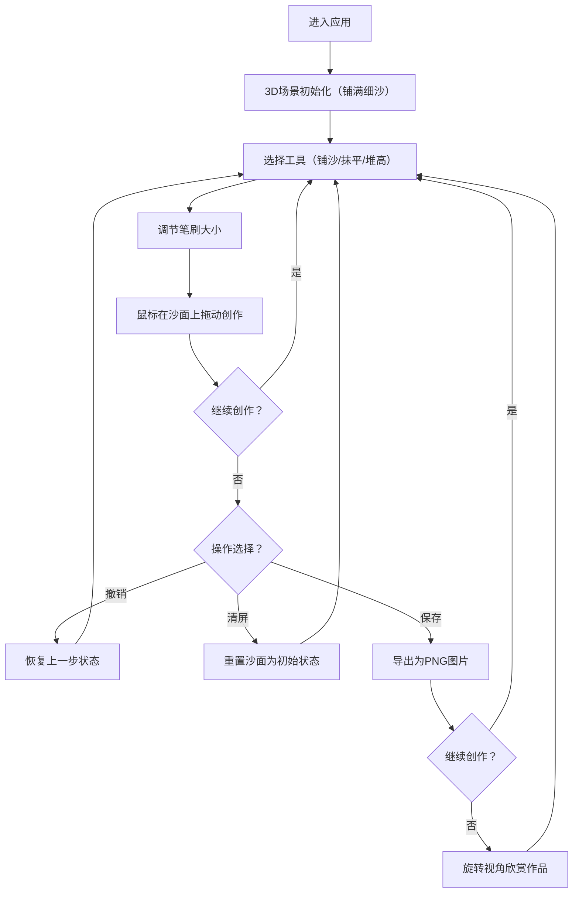

## 1. 产品概述
3D交互式沙画台应用，让用户像在真实沙画台上一样用手指/鼠标在3D场景中创作沙画作品。通过铺沙、抹平、堆高等工具实时塑造沙面形态，配合侧光效果展现沙子的纹理与光影变化，创作出山川河流等艺术作品，并可保存、撤销、旋转欣赏。
- 目标用户：艺术爱好者、创意工作者、休闲娱乐用户
- 产品价值：提供沉浸式3D沙画创作体验，将传统沙画艺术与现代3D技术结合

## 2. 核心功能

### 2.1 用户角色
| 角色 | 注册方式 | 核心权限 |
|------|----------|----------|
| 普通用户 | 无需注册，直接使用 | 使用所有创作工具、保存图片、撤销操作 |

### 2.2 功能模块
1. **主创作页面**：3D沙画场景、工具栏、操作面板、视角控制

### 2.3 页面详情
| 页面名称 | 模块名称 | 功能描述 |
|-----------|-------------|---------------------|
| 主创作页 | 3D沙画场景 | 展示细沙平面，支持鼠标交互作画，实时渲染沙子厚度与光影 |
| 主创作页 | 工具栏 | 提供铺沙、抹平、堆高三种工具切换，支持笔刷大小调节 |
| 主创作页 | 操作面板 | 撤销、清屏、保存图片功能按钮 |
| 主创作页 | 视角控制 | 鼠标拖拽旋转3D视角，滚轮缩放欣赏作品 |

## 3. 核心流程
用户进入页面后，默认处于"铺沙"工具状态，在3D沙面上拖动鼠标即可拨开沙子露出底部发光层。切换工具可改变沙面形态（堆高/抹平）。创作过程中可随时撤销上一步或清屏重画，完成后可保存为图片并旋转视角欣赏作品。

## 4. 用户界面设计

### 4.1 设计风格
- **主色调**：深色背景（#0a0a0f）搭配沙金色（#d4a574）和暖橙色发光层（#ff8c42）
- **辅色调**：细沙米白（#f5e6d3）、深棕阴影（#3d2817）
- **按钮风格**：圆形/圆角矩形，玻璃拟态（glassmorphism）效果，半透明磨砂质感
- **字体**：Cinzel（标题/装饰性）+ Noto Sans SC（正文/功能性）
- **布局风格**：全屏沉浸式，工具栏悬浮于画面边缘，最小化UI干扰
- **图标风格**：Lucide图标，线性风格，沙金色调

### 4.2 页面设计概述
| 页面名称 | 模块名称 | UI元素 |
|-----------|-------------|-------------|
| 主创作页 | 3D沙画场景 | 全屏3D画布，细沙粒子效果，侧面温暖光线投射，底部发光层 |
| 主创作页 | 工具栏 | 顶部悬浮玻璃面板，三个工具图标（铺沙/抹平/堆高）+ 笔刷滑块 |
| 主创作页 | 操作面板 | 左下角悬浮，撤销/清屏/保存按钮，玻璃拟态风格 |
| 主创作页 | 视角控制 | 右键/中键拖拽旋转，滚轮缩放，重置视角按钮 |

### 4.3 响应式
- 桌面端优先，全屏体验最佳
- 移动端支持触摸手势作画与双指旋转缩放
- 工具栏在小屏设备上自动调整布局与尺寸

### 4.4 3D场景指引
- **环境/HDRI**：暗调工作室环境，暖色系侧光，营造戏剧化光影对比
- **光照设置**：主光源从45度侧面投射（模拟聚光灯效果），环境光+底部自发光层
- **相机设置**：PerspectiveCamera，初始45度俯视角度，支持OrbitControls环绕观察
- **构图与焦点**：沙画台居中，边缘使用暗色渐变自然过渡
- **交互与动画**：笔刷触沙微震动效果，沙粒散落粒子动画，光影实时更新过渡
- **后处理效果**：SSAO环境光遮蔽，Bloom光晕发光层，细微胶片颗粒
- **性能优化**：使用Canvas/Shader渲染沙面高度图，避免过多粒子开销，目标60fps
