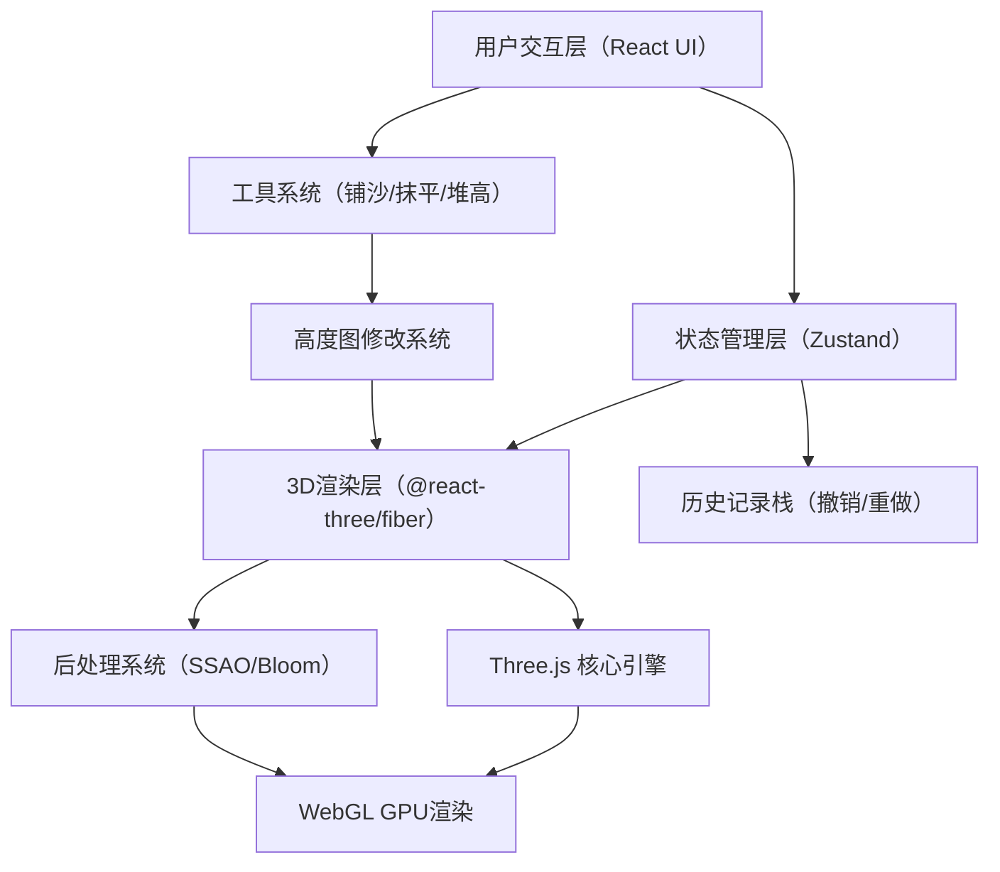

## 1. 架构设计



## 2. 技术描述
- **前端框架**：React@18 + TypeScript + Vite@5
- **样式方案**：TailwindCSS@3 + CSS Variables 主题系统
- **3D引擎**：Three.js @react-three/fiber@8 + @react-three/drei@9 + @react-three/postprocessing@2
- **状态管理**：Zustand@4
- **图标库**：Lucide React
- **初始化工具**：vite-init
- **后端**：无（纯前端SPA）
- **数据存储**：LocalStorage（可选保存历史状态），内存History栈（撤销功能）

## 3. 路由定义
| 路由 | 目的 |
|-------|---------|
| / | 主创作页面，沙画台主界面 |

## 4. 核心模块架构

### 4.1 沙画核心系统（SandCanvas）
```typescript
// 沙面高度图数据结构
interface SandHeightMap {
  width: number;       // 高度图宽度（像素）
  height: number;      // 高度图高度（像素）
  data: Float32Array;  // 高度值数组 [0, 1]，0=无沙，1=最厚
}

// 工具类型
type ToolType = 'sweep' | 'flatten' | 'pile';

// 笔刷配置
interface BrushConfig {
  size: number;        // 笔刷半径 5-100
  strength: number;    // 笔刷强度 0-1
  tool: ToolType;
}

// 沙画状态
interface SandState {
  heightMap: SandHeightMap;
  history: SandHeightMap[];
  historyIndex: number;
}
```

### 4.2 核心组件结构
```
src/
├── components/
│   ├── SandArt/
│   │   ├── SandCanvas3D.tsx    # 3D沙画场景主组件
│   │   ├── SandMesh.tsx        # 沙面Mesh（自定义Shader）
│   │   ├── LightSetup.tsx      # 灯光设置
│   │   └── GlowLayer.tsx       # 底部发光层
│   ├── UI/
│   │   ├── Toolbar.tsx         # 工具栏（工具选择+笔刷调节）
│   │   ├── ActionPanel.tsx     # 操作面板（撤销/清屏/保存）
│   │   └── ViewControls.tsx    # 视角控制提示
│   └── AppLayout.tsx           # 整体布局
├── hooks/
│   ├── useSandHeightMap.ts     # 高度图操作Hook
│   ├── useBrushInteraction.ts  # 笔刷交互Hook
│   └── useHistory.ts           # 撤销历史Hook
├── store/
│   └── sandStore.ts            # Zustand状态管理
├── shaders/
│   ├── sandVertex.glsl         # 沙面顶点Shader（高度图位移）
│   └── sandFragment.glsl       # 沙面片元Shader（材质+光影+透光）
├── utils/
│   ├── heightMapUtils.ts       # 高度图工具函数
│   └── exportUtils.ts          # 图片导出工具
├── pages/
│   └── Home.tsx                # 主页
└── App.tsx
```

## 5. 关键技术实现方案

### 5.1 沙面渲染技术
- **高度图方案**：使用Float32Array存储沙面高度数据，通过Shader将顶点沿法线方向位移
- **材质系统**：自定义Shader实现沙子质感（漫反射+高光+微表面法线扰动）
- **透光效果**：根据高度值计算透光率，越薄的地方底部发光越明显
- **Shader逻辑**：
  ```glsl
  // 高度采样 → 顶点位移
  float height = texture2D(u_heightMap, vUv).r;
  vec3 displaced = position + normal * height * u_maxHeight;
  
  // 透光计算（底部发光）
  float transmittance = 1.0 - smoothstep(0.0, u_thicknessThreshold, height);
  vec3 glowColor = u_glowColor * transmittance * u_glowIntensity;
  
  // 最终颜色 = 沙面材质颜色 + 发光层 + 光影
  gl_FragColor = vec4(sandColor + glowColor, 1.0);
  ```

### 5.2 笔刷交互系统
- **射线检测**：Three.js Raycaster从鼠标位置发射射线，与沙平面求交
- **UV坐标映射**：将交点坐标转换为高度图UV坐标，确定影响区域
- **笔刷算法**：
  - `sweep（铺沙/拨开）`：在圆形区域内降低高度值（高斯衰减）
  - `pile（堆高）`：在圆形区域内增加高度值
  - `flatten（抹平）`：将区域高度向平均值过渡
- **插值平滑**：使用requestAnimationFrame在拖动点之间插值，避免断续

### 5.3 撤销/历史系统
- **快照策略**：每次鼠标抬起时保存高度图快照（Float32Array深拷贝）
- **栈结构**：最大保存50步历史，超出后移除最旧记录
- **性能优化**：使用TypedArray共享内存或压缩存储

### 5.4 光影系统
- **主光源**：DirectionalLight，从-45°侧上方投射，投影开启
- **环境光**：AmbientLight低强度，避免死黑
- **底部发光**：Emissive材质层，根据高度值动态混合
- **后处理**：
  - SSAO：增强沙面凹凸细节的阴影感
  - Bloom：让发光层和高光产生光晕效果
  - Vignette：聚焦视觉中心

## 6. 性能优化策略
| 优化点 | 方案 |
|--------|------|
| 高度图分辨率 | 默认512x512，可调节，避免过高分辨率 |
| Shader计算 | 所有高度图处理在JS侧完成后上传纹理，避免每帧读取像素 |
| 网格细分 | PlaneGeometry细分度平衡（128x128或256x256） |
| 历史快照 | 仅保存差异（可选增量），使用RLE压缩 |
| 渲染循环 | 仅交互时强制重绘，静止时降低刷新率 |
